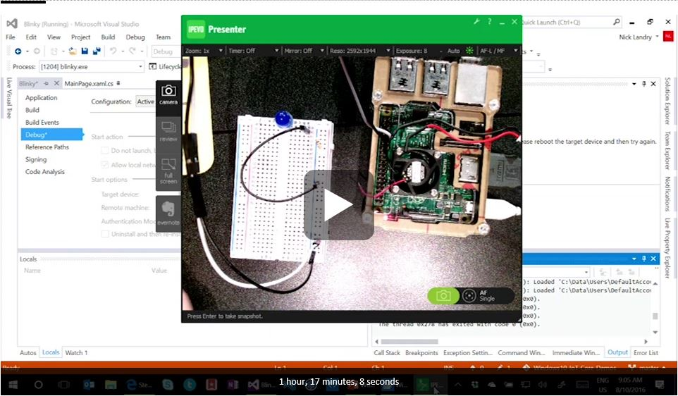

# Windows10-IoT-Core-Demos
Various demos for learning maker &amp; IoT projects on [Windows 10 IoT Core](http://dev.windows.com/iot) using UWP &amp; C#, Arduino, etc. The demos include a variety of original demos as well as official Microsoft & third-party samples I use frequently in conference & meetup talks.

## SAMPLES
- **Blinkly (C#)**: Blink an LED, aka Hello World "Maker Edition"
- **PushButton (C#)**: Basic push button sample to light an LED
- **GHI (C#)**: Sample app to test the capabilities of various Hats & Shields from GHI Electronics, including Gadgeteer
- **GHI (C#) Light & Temp**: Measure ambient light & temperature using the GHI Electronics FezHat

## VSLive Redmond Session Video
You can watch one of my sessions on [Windows for Makers](https://channel9.msdn.com/Events/Visual-Studio/Visual-Studio-Live-Redmond-2016/W03) - covering development for Windows 10 IoT Core - recorded live at [Visual Studio Live](http://vslive.com) Redmond [right here on Channel 9](https://channel9.msdn.com/Events/Visual-Studio/Visual-Studio-Live-Redmond-2016/W03). It features some of the demos in this repository.

## The Maker Show Episode 5 - Installing Windows 10 on a Raspberry Pi 2
In [this episode of The Maker Show](https://channel9.msdn.com/Shows/themakershow/5), Kenny Spade gets Windows 10 up and running on a Raspberry Pi 2, and takes a look at what it comes with out of the box. He examines setup with a display for the Pi, how you can get the system up and running in a headless mode through the Windows 10 IoT Core Dashboard and the Windows Device Portal, and takes a look at the options that gives you. Finally, he connects through a remote PowerShell session to see what opportunities open up.

## The Maker Show Episode 17 - Coding & GPIO in Windows 10 IoT Core
In [this episode of The Maker Show](https://channel9.msdn.com/Shows/themakershow/17), I talk about the tools, how to get started, what it means to build for the Universal Windows Platform, and how to build your first simple Windows hardware project on the Raspberry Pi using C# and XAML.

## Follow Me
* Twitter: [@ActiveNick](http://twitter.com/ActiveNick)
* Blog: [AgeofMobility.com](http://AgeofMobility.com)
* SlideShare: [http://www.slideshare.net/ActiveNick](http://www.slideshare.net/ActiveNick)
